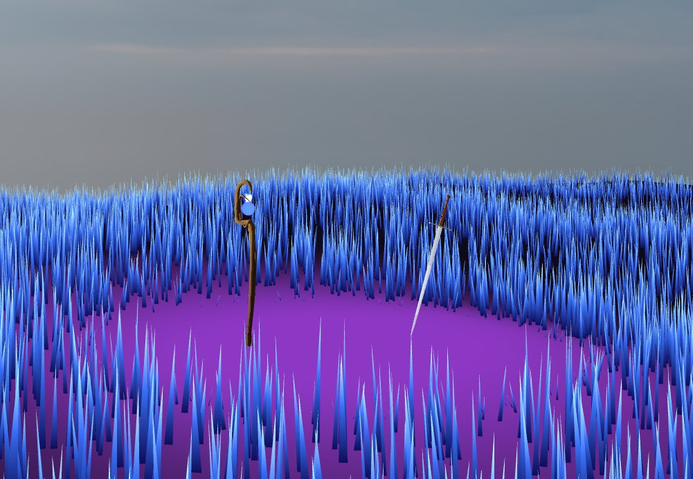
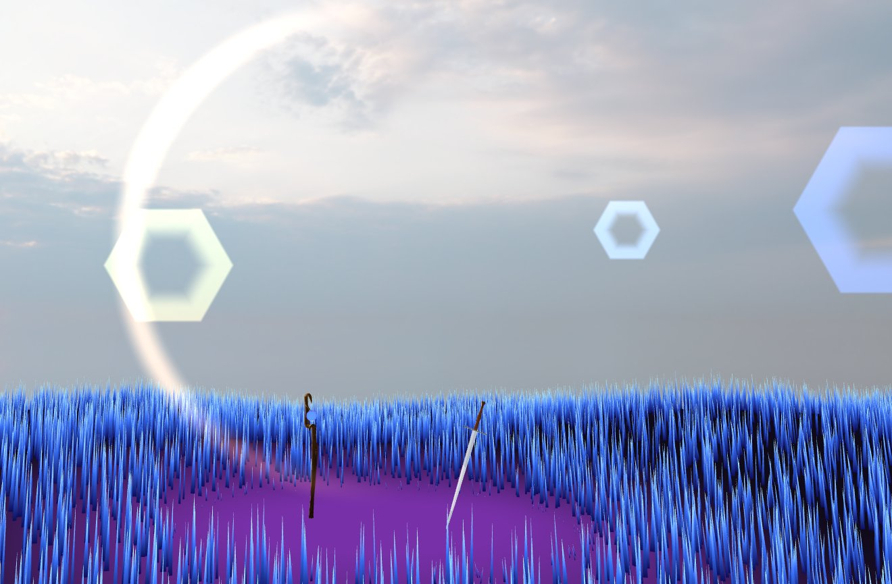
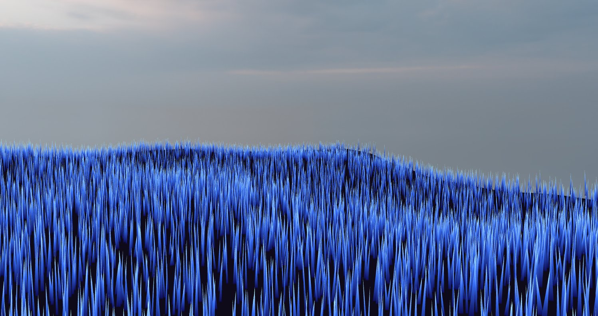

# OpenGL Rendering Engine

A real-time 3D rendering engine built with **OpenGL and C++** as part of the INF2705 Computer Graphics course at Polytechnique Montréal.

The scene features a magic sword-and-staff environment rendered with advanced GPU techniques including tessellation, geometry shaders, a GPU particle system, lens flare, and an HDR skybox.

---

## Screenshots

*Magic grass field with procedural tessellation and glowing ground zone*

*Multi-pass lens flare with hexagonal bokeh artifacts and HDR skybox*

*Close-up of procedural crystal-style grass with adaptive LOD tessellation*

---

## Features

### 🌿 Magic Grass (my contribution)
- **Tessellation pipeline (TCS + TES)** with adaptive LOD based on camera distance
- **Geometry shader** generating procedural crystal-style grass blades with cylindrical billboarding
- **Procedural animation** — blades sway using time-dependent sinusoidal calculations
- **Glowing tips** — fragment shader produces a pulsating glow effect at blade tips based on height and time
- **Random variation** in blade width, height, and animation phase for natural appearance
- **Scene interaction** — grass is smoothly suppressed around the magic ground zone using `smoothstep`

### ✨ Magic Ground (my contribution)
- Subdivided grid deformed in the **vertex shader** using sinusoidal functions to produce an irregular terrain
- Central magic zone acts as the focal point of the scene with distance-based attenuation
- **Pulsating circular glow** in the fragment shader using time-based sinusoidal calculations

### ⚔️ Sword & Magic Staff (teammate)
- 3D models imported from `.ply` files using a custom loader (happly)
- Rendered with a **Phong illumination shader** (ambient + diffuse + specular)
- Textures applied for realism
- Staff floats via sinusoidal vertical translation; orb rotates over time
- **GPU particle system** — magic particles emitted from the staff orb, animated with color, size, and opacity variation over lifetime, rendered via a geometry shader billboard

### 🌌 Skybox, Sun & Camera Effects (teammate)
- **HDR skybox** using an EXR texture loaded via TinyEXR
- Sun position detected from the brightest area of the EXR texture
- **Multi-pass lens flare** — first pass checks sun occlusion via geometry, second pass renders optical artifacts (halos, rings)
- **Camera shake** — subtle movement during displacement for a more natural feel

---

## Tech Stack

| Category | Technologies |
|---|---|
| Language | C++ |
| Graphics API | OpenGL |
| Shaders | GLSL (vertex, fragment, geometry, tessellation, compute) |
| GUI | ImGui |
| Image Loading | stb_image, TinyEXR |
| Model Loading | happly (.ply) |
| Build | CMake, Visual Studio |

---

## Controls

| Input | Action |
|---|---|
| `WASD` | Move camera |
| `Mouse` | Rotate camera (toggle with `Space`) |
| `Arrow keys` | Rotate camera |
| `Q / E` | Move up / down |
| `ImGui panel` | Real-time scene parameters |

---

## External Libraries & Assets

- **ImGui** — immediate mode GUI
- **stb_image** — image loading
- **TinyEXR / zlib** — HDR EXR texture loading
- **happly** — `.ply` model loading
- **Skybox EXR** — [Polyhaven](https://polyhaven.com)
- **Sword & staff models/textures** — provided as part of course assignment

---

## Team

Developed in a team of 3 as part of **INF2705 – Computer Graphics** at Polytechnique Montréal (Winter 2026).
